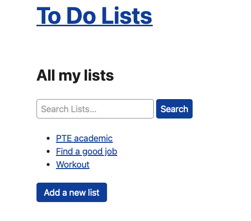

# Introduction

The To Do List App is a web application designed to help users manage their tasks efficiently. Users can create, read, update, and delete tasks. The application is built using Django, a high-level Python web framework that encourages rapid development and clean, pragmatic design.

## Features

* CRUD Operations to Manage Tasks: Users can create new tasks, edit their existing tasks, and delete tasks they no longer need.
* Due Dates: Users can set due dates for their tasks and see which tasks are overdue.
* Search Functionality: Users can search for to-do list using keywords.

## Prerequisites
* Python 3.x
* Django 3.x or higher